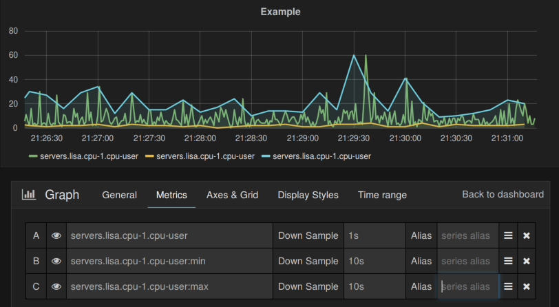
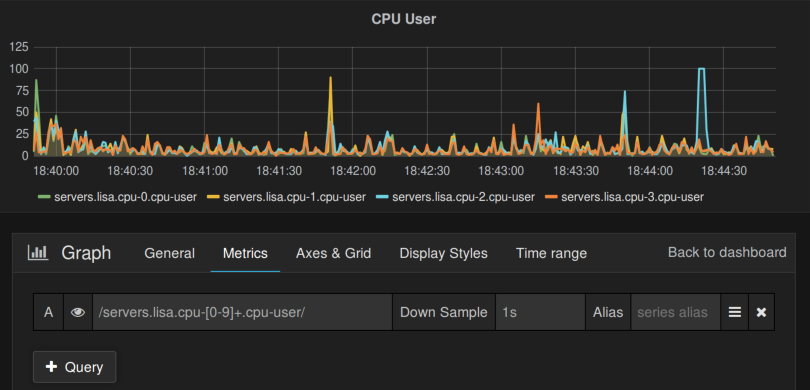
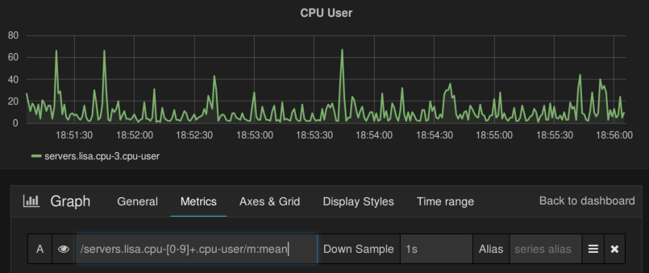

# Overview

Momo is Scala/Akka based application to manage time-series data in 
[Couchbase](http://www.couchbase.com/) and display it 
using [Grafana](http://grafana.org/).

Features:

* Integrates easily with other monitoring tools due to StatsD
and Graphite compatible interface (UDP).
* REST interface to push metrics and query time-series.
* Minimum configuration required to get started.

## Changes Since 0.5.1

### No Built-In Grafana

Momo does not ship with Grafana built in anymore. As Grafana 2 has its own
server side component now the choices were:

- stick to Grafana 1.9.x.
- Re-implement all the server side features of Grafana.
- Make Momo a standard database backend for Grafana, just serving metrics.

I invested some time into the second option but came to the conclusion that
my time is better spent on metrics features than on something that already
exists. Being stuck on Grafana 1.9.x was not very appealing either, thus I
decided for the third option.

# Getting Started

## Installing Grafana

Download one of the
[Grafana releases](https://github.com/ngrossmann/grafana/releases) with
Momo support (tags start with m) and install it as described in the
[Grafana documentation](http://docs.grafana.org/installation/).

Create a new database connection with the following settings:

- Name: Momo (or what ever you like)
- Type: Momo
- Url: http://<momo-host>:<momo-port>/

## Installing Binary Momo Packages

Running Momo should be easy:

1. Download Momo in your preferred format from the [release page](releases).
2. Add the Couchbase connection information to application.conf.
3. Create Couchbase views.
4. Point your browser to [http://localhost:8080](http://localhost:8080/)

The location of files depends on the package you downloaded.
If you installed the RPM or DEB the `application.conf` can
be found in `/etc/momo`, `momo` the start script in `/usr/bin`
and all other files, e.g. view definition in `/usr/share/momo`.

If you extracted the tarball the respective files are in `etc`,
`bin` and `share`

## Configure Couchbase

By default Momo connects to Couchbase at 127.0.0.1:8092 using bucket
`default` and no password. This can be changed by editing
`application.conf`.

Add a section like:

```
couchbase {
  cluster = ["127.0.0.1:8092"]
  bucket = "default"
  password = ...
}
```

Momo requires two view documents which can be created by running
momo-create-view.

DEB/RPM:

```
$ /usr/sbin/momo-create-views -b default -n localhost:8092
```

Tarball: 

```
$ bin/momo-create-views -b default -n localhost:8092 -s share
```

`momo-create-views` Parameters:

* `-b`: bucket name (default default)
* `-s`: directory containing view definition (default /usr/share/momo)
* `-n`: Couchbase node name (default localhost:8092)
* `-p`: Prompt for bucket password

## Other Configuration Settings

All default settings can be found in
[reference.conf](https://github.com/ngrossmann/momo/blob/master/src/main/resources/reference.conf)
and overridden in `etc/application.conf`.

Listen addresses for http, graphite and the statsd interface:

```
momo {
  graphite {
    enabled = true // enabled by default
    listen-address = "0.0.0.0"
    port = 8125
  }

  http {
    listen-address = "0.0.0.0"
    port = 8080
  }

  statsd {
    enabled = true // disabled by default
    listen-address = "0.0.0.0"
    port = 8125
  }
  ...
}
```

Metric settings:

```
momo {
  metric-ttl = 1 day
  document-interval = 10 minutes
  ...
}
```

* `metrics-ttl`: Time-to-live for all metrics. This setting depends highly
  on the number of data-points you collect and the size of your Couchbase
  cluster. Ideally all data should fit in RAM to be really fast.
* `document-interval`: Momo does not create a new document per data point,
  but a new document for each time-series per interval. The default is
  10 minutes, intended to be used with collection intervals of a few seconds.
  If you collect metrics in minute intervals you may want to increase this
  to `60 minutes` or more.

# Using Momo

## Feeding Data

Momo currently supports three protocols it's own HTTP/Json based protocol,
StatsD and Graphite (UDP).

### StatsD

This is probably the easiest way to get data into Momo
```
echo "server.myhost.random:$RANDOM|g" | nc -u -w0 127.0.0.1 8125
```

Unlike StatsD Momo does not aggregate/count events to build time-series, 
it expects to receive values at a regular interval and pushed those 
values directly to Couchbase.

### Graphite

Pretty close to StatsD:

```
echo "server.myhost.random $RANDOM `date +%s`" | nc -u -w0 127.0.0.1 2003
```

### HTTP/Json

You can send metric data via HTTP/Json, the Json document must have
the following structure:

```
{
  name: "time.series.name",
  timestamp: <timestamp in milliseconds since the epoch>
  value: <long value>
}
```

Curl example sending random value:

```
 echo "{\"name\": \"server.myhost.random\", \"timestamp\ $(date  -u +'%s')000, \"value\": $RANDOM}" \
  | curl -d@- -H Content-Type:application/json http://localhost:8080/series
```

### Using Diamond

[Diamond](https://github.com/python-diamond/Diamond) is an easy to use agent
to collect system and
[all other kinds](https://github.com/python-diamond/Diamond/wiki/Collectors)
of metrics. To feed data from Diamond to Momo install the python-statsd
package and configure the 
[StatsD handler](https://github.com/python-diamond/Diamond/wiki/handler-StatsdHandler)
in /etc/diamond/diamond.conf:

```
# Handlers for published metrics.
handlers = diamond.handler.stats_d.StatsdHandler
...
[[StatsdHandler]]
host = <momo host>
port = 8125
```

### Using Collectd

Data from collectd can be pushed using the Graphite UDP interface.

collectd.conf:

```
...
LoadPlugin write_graphite
...
<Plugin write_graphite>
        <Node "example">
                Host "momo.example.com"
                Port "2003"
                Protocol "udp"
                LogSendErrors true
                Prefix "servers."
                Postfix ""
                StoreRates true
                AlwaysAppendDS false
                EscapeCharacter "_"
        </Node>
</Plugin>
...
```
## Query Language

### Basics

Momo's query language allows you to retrieve an arbitrary number of
time-series by name or pattern in one query, aggregate them and apply
binary functions.

A query is always done within a context which sets the time range of the
query and the sample rate (interval between data-points). This context
applies to all time-series within one query. After retrieving raw
time-series data from Couchbase Momo re-samples each time-series into
the query-context's sampling rate using a normalization function,
before any further processing is done. Currently supported
normalization functions are `mean`, `sum`, `max`, `min`, the function is
appended to the time-series name, separated by colon.

To make queries URL friendly and easy to parse Momo uses reverse polish
notation for it's query language, all elements, operands (time-series)
and functions, are separated by comma.

The basic syntax of a query is:

```
timeseries[:normalizer](,(function|timeseries[:normalizer]))*
```

I.e. a query always starts with a time-series which may be followed by
an optional normalizer function. Subsequent elements may be functions
or time-series.

Time-series are pushed on to a stack, if a function is found the
required number of time-series is pulled from the stack (currently always
two), the function is applied to all values and the result is pushed back
onto the stack.

After processing all functions the time-series remaining on the stack
are returned as result.

Supported functions are: avg, plus, minus, mul, div.

Example: Query Language Basics



The screenshot shows three queries on the same time-series
`servers.lisa.cpu-1.cpu-user` with different parameters. The
raw data's sample rate is 1 second.

1. Query: `servers.lisa.cpu-1.cpu-user`, Down Sample `1s`: This query
    uses implicitly the normalizer `:mean`.
2. Query: `servers.lisa.cpu-1.cpu-user:min`, Down Sample `10s`: Aggregates
    10 data points into one by using the smallest value.
3. Query: `servers.lisa.cpu-1.cpu-user:max`, Down Sample `10s`: Aggregates
    10 data points into one by using the largest value.

### Using Regular Expressions to Retrieve Time-Series

Assuming you want to display the the total cpu-user value for all CPUs you
you don't have to add 4 queries you can uses a regular expression matching
all time-series. To mark a string as regular expression it has to be
enclosed in `/.../`.

Example 2: Get multiple time-series with one regular expression



It's also possible to merge all matching time-series into one by enclosing
the regular expression with `/.../m`. Assuming you just want to display
one CPU user time-series instead of one per core you could use
`/servers.lisa.cpu-[0-9]+.cpu-user/m:mean` (`:mean` would not be needed in
this case as it's the default)


Example 3: Merging regular expressions



## Configuring Dashboards

The dashboard is a vanilla [Grafana 2](http://docs.grafana.org/),
most things work as described in the documentation, this section 
documents what is Momo specifc.

### Queries

Queries use the Query language described above, `Down Sample` sets
the query contexts sample-rate.

`Alias` can be used to to change the display name. As in other Grafana
dashbords `$n` can be used to reference segments of the original name.

### Templating Queries

Grafana supports templates based on DB queries Momo has basic
support for this. To define a `hostname` template variable 
selecting all hosts which send the metric 
`momo.<hostname>.router.user_db_metric.processing-time_ms`
from above use `router.user_db_metric.processing-time_ms` as
variable values query. Currently this query returns all
time series which contain the query as substring.

As regex you could use `/[^.]*\.([^.]*)\..*/` to cut out
the hostname.

# Build From Source

## Prerequisites

* JDK 7 or 8
* [sbt](http://sbt-scala.org/)
* npm/nodejs (on Debian/Ubuntu install packages npm, nodejs, nodejs-legacy)
* configure Couchbase as described in ``Configure Couchbase`` (if you want
  to run directly from SBT)
* grunt (as root: npm install -g grunt-cli)
* edit etc/application.conf to point to your Couchbase cluster/instance.
 
## Run Inside SBT

After cloning the repository cd into the root directory. 

```
$ sbt
> reStart
```

During the build you will see error messages like

```
[info] Running "uglify:dest" (uglify) task
[error] WARN: Dropping unused function argument url [dist/app/app.53caa7d6.js:1778,50]
[error] WARN: Dropping unused function argument moduleName [dist/app/app.53caa7d6.js:1778,38]
```

They can be ignored. sbt calls grunt to build the java-script UI, grunt
logs the WARN messages to stderr which is highlighted by sbt as error.

`reStart` compiles the Scala backend and starts it, to stop it type `reStop`.

## Building Packages

Native Linux packages (both tasks require the respective build tools):

* `debian:packageBin`
* `debianSystemd:packageBin`: DEB package using systemd as init-system
* `rpm:packageBin`.

Tar.gz:

* `universal:packageZipTarball`
